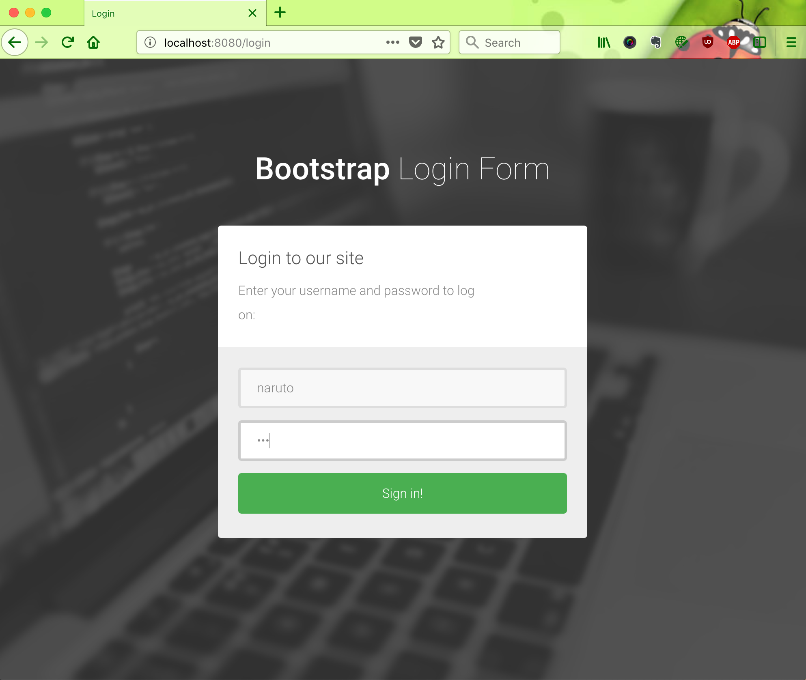

# Spring Boot Kotlin Sample

<!-- [](https://spring-boot-kotlin-example.herokuapp.com)
-->
This is spring boot kotlin example.

<!--
## Live Demo

https://spring-boot-kotlin-example.herokuapp.com

-->




## Login

|#|Username|Password|
|---|---|---|
|1|naruto|123|
|2|user|456|
|3|sasuke|212|
|4|hendisantika|234|

## How to run?
### clone
```
# git clone https://gitlab.com/hendisantika/spring-boot-kotlin-sample.git
```
### run
```sh
# mvn clean spring-boot:run
```
or
```
# mvn install
# java -jar target/spring-boot-kotlin-sample-0.0.1-SNAPSHOT.jar
```

## use 
1. Kotlin 1.2.71
2. Spring Boot 2.0.5.RELEASE version
3. JPA (Hibernate) 5.2.17
4. H2 Embedded Database
5. Yhymeleaf 3.0.0
6. Spring Security 5


## spring boot kotlin sample code
### Main sample
```kotlin
@SpringBootApplication
open class SpringBootKotlinExampleApplication constructor(val accountRepository: AccountRepository, val messageRepository: MessageRepository) : CommandLineRunner{
  override fun run(vararg p0: String?) {
    //.. some logic  
  }
}

fun main(args: Array<String>) {
  SpringApplication.run(SpringBootKotlinExampleApplication::class.java, *args)
}
```
### Service sample
```kotlin
@Service
@Transactional
open class MessageService constructor(val messageRepository: MessageRepository){

  @Transactional(readOnly = true)
  open fun findAll() : List<Message> {
    return messageRepository.findAll()
  }
  // ... some logic 
}
```


